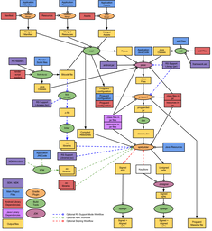

class: center, middle, inverse
# Workshop Mobile Java/Android
## CRM13 - 2ème année
---

class: center, middle, inverse
# Bonjour !
---

.left-column[
## Louis Beltramo
### - SRC Montbéliard / Gobelins Annecy
### - Freelance / Bocalènco
### - développeur web, mobile et multimédia
### - louis@beltramo.me
]

.right-column[
.pull-left[
### Un soupçon de desktop
- C/C++
- AS3/Air
- Haxe

### Un peu de back
- PHP/Wordpress
- Ruby/Rails
- GNU Linux/Docker

### Du mobile
- AS3/Air
- Haxe
- Java/Android
- JS/Cordova
]

### Quelques plateformes
- GNU/Linux
- Windows
- Android
- iOS
- Blackberry
- Tizen (IVI)
- Raspberry Pi
- Arduino
- Web
]
---

class: center, middle, inverse
# Modalités
---

.left-column[
## Modalités
### - Rendu
]

.right-column[
# .center[Lundi 27 octobre 2014 à 23h59]
]
---

.left-column[
## Modalités
### - Rendu
### - Livrables
]

.right-column[
### Claroline
- zip des sources
- apk de l'appli
- Vidéos / captures d'écrans
- document d'info le projet
- lien vers le dépôt

### Dépôt Git
- Projet complet versionné
- historique des commits reflétant votre progression
- README.md _le document d'info_
- APK via releases/downloads
]
---

.left-column[
## Modalités
### - Rendu
### - Livrables
### - Barême
]

.right-column[
## Ce qui rentre dans les critères d’évaluation :
- Projet complet et fonctionnel : .center[__5 points__]
- Qualité du travail : .center[__5 points__]
- Maîtrise des concepts Java : .center[__3 points__]
- Maîtrise des concepts Android : .center[__3 points__]
- Ergonomie : .center[__2 points__]
- Qualité du code source : .center[__1 point__]
- Gestion du projet : .center[__1 point__]

## Ce qui ne rentre pas dans les critères d’évaluation :
- le graphisme
- les bugs mineurs
]

???

Respect des contraintes, pas de bug majeur empêchant le fonctionnement du projet ainsi que ses fonctionnalités principales.

Niveau d’aboutissement du projet et des recherches personnelles, prise en compte des spécificités du développement mobile.

Ex : programmation orienté objet, interfaces, threads, traitement des exceptions, gestion de la mémoire,…

Ex :Activity, Intent, Fragment, Layout, View, Resources, Content resolver, Services, Action Bar, SharedPreferences, Support Library,...

L'application doit être facilement utilisable et suivre les bonnes pratiques pour l'UI mobile en général et celles d'Android en particulier.

Le code source doit être bien organisé, facilement lisible, commenté et suivre des conventions cohérentes (pas de « franglais », indentation, nommage,…).

Utilisation correcte de Git/Mercurial, documentation des points délicats, utilisation de bibliothèques externes,...
---

class: center, middle, inverse
# Un peu de théorie
---

.left-column[
## Développement Mobile
### - Contraintes
]

.right-column[
## les plateformes
## le matériel
## le réseau
]

???

## - les plateformes
- fragmentation
- rapidité d'évolution
- vendor lock-in

## - le matériel
- CPU limité
- RAM limitée
- batterie limitée

## - le réseau
- connexions intermittentes
- faible bande passante
- latence élevée

Environnement particulièrement contraint => natif

Forte demande => forte évolution
---

.left-column[
## Développement Mobile
### - Contraintes
### - Spécificités
]

.right-column[
## affichage
## gestures
## capteurs
## connexions
]

???

## affichage
- taille d'écran
- densité
- format
- multiplicité

## gestures
- touch
- swipe
- pan
- rotate
- ...

## capteurs
- géoloc
- boussole
- gyroscope
- ...

## connexions
- ble
- wifi
- nfc
- ...
---

.left-column[
## Développement Mobile
### - Contraintes
### - Spécificités
### - Bénéfices
]

.right-column[
## outils évolués
## interactions riches
## monétisation
## forte demande
## bases pour les solutions multi-plateformes
]

???

Environnement particulièrement contraint
=> outils puissant

IDE, débogage, test,...

Plugins et extensions natives pour le multiplateforme
---

class: center, middle, inverse
# Android
---

.left-column[
## Android
### - Material Design
]

<video autoplay="true" loop="true">
    <source src="https://developer.android.com/preview/material/videos/ContactsAnim.mp4" />
</video>
---

.left-column[
## Android
### - Material Design
### - Android L
]
.right-column[
.pull-right[]
## Notifications
## Project Volta
## ART
- Remplace Dalvik
]

???
__ART__ Ahead-of-time (AOT) compilation

---

.left-column[
## Android
### - Material Design
### - Android L
### - Android Wear
]

.right-column[
.pull-right[]
## Mobile & Wear
- Applis "déportés"
]
---

.left-column[
## Android
### - Material Design
### - Android L
### - Android Wear
### - Android TV
]

.pull-left[]
---

.left-column[
## Android
### - Material Design
### - Android L
### - Android Wear
### - Android TV
### - Android Auto
]

.pull-left[]
---

.left-column[
## Android
### - Material Design
### - Android L
### - Android Wear
### - Android TV
### - Android Auto
### - OK Google
]

.pull-left[]
---

class: center, middle, inverse
# Android Studio
---

.left-column[
## Android Studio
### - ADT ?
]

.right-column[
## ADT
- Eclipse
- Ant
- Abandonné par Google

## Android Studio
- IntelliJ Idea
- Gradle
- Futur IDE officiel pour Android
]
.right[]
---

.left-column[
## Android Studio
### - ADT ?
### - Gradle
]

.right-column[
.pull-right[]
## Automate everything
- Gestion des assets
- Gestion des librairies
- Compilation
- Build de l'APK
- Signature
- ...

## Groovy
- Langage dynamique pour la JVM

```groovy
def commitHg(message) {
    def stdout = new ByteArrayOutputStream()
    exec {
        commandLine "hg", "commit", "-A", "-m", message
        standardOutput = stdout
    }
    println stdout.toString()
}

```
]

???
Ex: Grunt, Gulp, Robo, Rake, Leinigen...


---

.left-column[
## Android Studio
### - ADT ?
### - Gradle
### - Maven
]

.right-column[
## Dépôt centralisé

```groovy
import java.util.regex.Pattern

apply plugin: 'com.android.application'

repositories {
    mavenCentral()
}
```

## Gestionnaire de dépendances
```groovy
    compile 'com.doomonafireball.betterpickers:library:1.5.+'
    compile 'com.android.support:support-v4:20.0.+'
    compile 'com.google.android.gms:play-services:4.4.+'
```
]

???

- Gestionnaire de dépendance (entre autres)
- PHP : Composer
- JS : NPM / bower
- Ruby : Gem / bundler
---

class: center, middle, inverse
# Git
---

.left-column[
## Git
### - Github.com
### - Bitbucket.org
### - Gitlab.com
]

.right-column[
## Pour visualiser tout ça
- https://windows.github.com/
- https://mac.github.com/
- http://www.sourcetreeapp.com/
- https://github.com/FredrikNoren/ungit
]
---

class: center, middle, inverse
# [The Echo Nest](http://the.echonest.com/)
